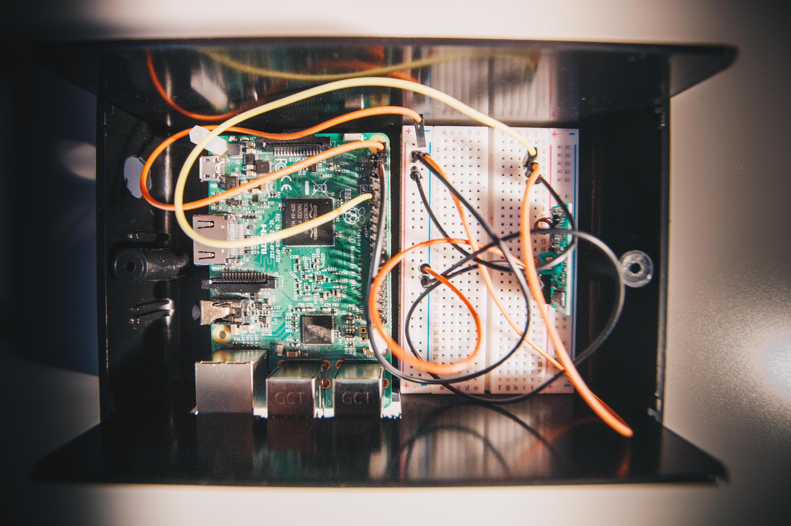

# raspberry
Smart-Home Controll 

# Nginx-Config with open-ssl Certificate
- /etc/nginx/sites-enabled: 
```
server {
        listen                          80;
        server_name                     192.168.1.$;
        return 301                      https://$server_name$request_uri;
}

server {
        listen                          443 ssl;
        server_name                     192.168.1.$;
        
        ssl_certificate                 /etc/ssl/openhab.crt;
        ssl_certificate_key             /etc/ssl/openhab.key;

        location / {
                proxy_pass                            http://127.0.0.1:8080/;
                proxy_buffering                       off;
                proxy_set_header Host                 $http_host;
                proxy_set_header X-Real-IP            $remote_addr;
                proxy_set_header X-Forwarded-For      $proxy_add_x_forwarded_for;
                proxy_set_header X-Forwarded-Proto    $scheme;
        }

}
```

# Photos of my self-made case



